# Tutorial to Customize the Favicon for a APEX Application
Below you will find instruction on how to customize your favicon for an Oracle APEX application. Please reference this learning video for more details [https://youtu.be/NUBga8Gsb9Y](https://youtu.be/NUBga8Gsb9Y)

- These steps assume you have created a favicon set, typically this is done by a UI/UX artist. In our example you can reference images in the /fav folder for the example in this repo. In many cases you will have considerably more favicon sizes for various devices than in this example.

 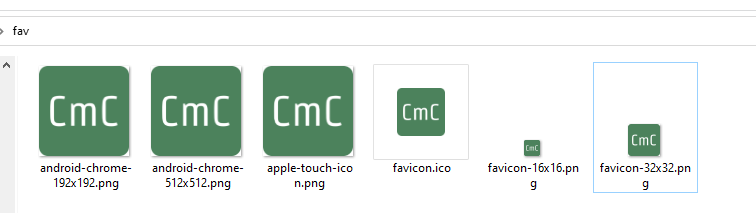

- Open your APEX workspace and click into your application.

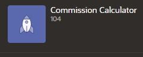

- Click on shared components.

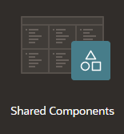

- Select static application files.

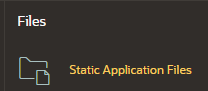

- Select Upload File and upload your files. In this example we uploaded a .zip with a folder /fav.

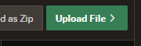
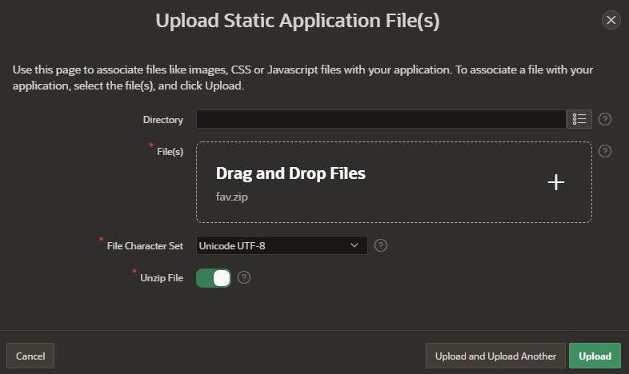

- Navigate back to shared components

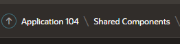

- Drill into User Interface Attributes

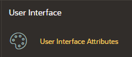

- Select favicon

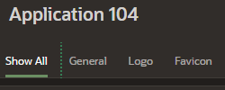


- Modify your HTML code and paste in. Below is an example of how to reference the favicons you uploaded to APEX earlier.

```
<link href="#APP_IMAGES#fav/favicon.ico" rel="shortcut icon">
<link href="#APP_IMAGES#fav/favicon-16x16.png" sizes="16x16 32x32" rel="icon">
<link href="#APP_IMAGES#fav/favicon-32x32.png" sizes="32x32" rel="icon">
<link href="#APP_IMAGES#fav/android-chrome-192x192.png" sizes="196x196" type="image/png" rel="icon">
<link href="#APP_IMAGES#fav/android-chrome-512x512.png" sizes="512x512" type="image/png" rel="icon">
<link href="#APP_IMAGES#fav/apple-touch-icon.png" sizes="180x180" rel="apple-touch-icon">
```

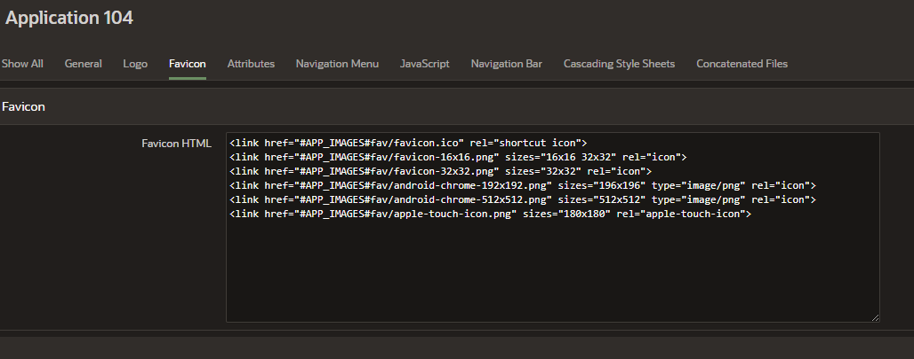

- Run your application and view the icon.

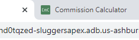
